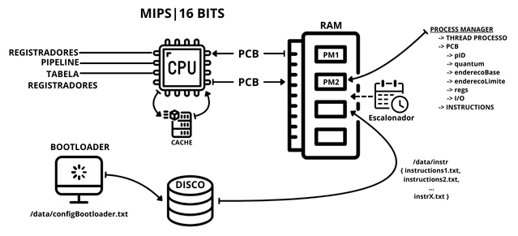

# Sistemas Operacionais: Desenvolvimento e Implementação de uma Arquitetura Multicore com Escalonamento e Gerência de Memória

<div align="center" style="display: inline_block">
  
  
  
</div><br/>

## 🗃️ Arquitetura do Projeto

<p align="center">
 
</p>
<p align="center">
<em>Figura 1: Diagrama representativo da arquitetura do simulador.</em>
</p>

<div align="justify">
A arquitetura do projeto foi idealizada com base no modelo conceitual acima, que representa os principais componentes e interações do simulador. Esse modelo serviu como referência para o desenvolvimento, mas a implementação final foi projetada de forma flexível, permitindo ajustes futuros para atender a requisitos práticos, aprimorar a eficiência e incorporar boas práticas de design.

Este projeto implementa um simulador da Arquitetura de Von Neumann com suporte a múltiplos núcleos, escalonamento e gerenciamento de recursos, utilizando um pipeline MIPS de 5 estágios (IF, ID, EX, MEM, WB). O simulador foi desenvolvido como parte do estudo de Sistemas Operacionais e visa explorar conceitos como execução paralela, escalonamento de processos e otimização de recursos.

</div>

## 🗂️ Estrutura do Projeto

<div align="justify">

- `src/`: Diretório com os scripts C++ usados para gerar os outputs e realizar as análises.
- `docs/`: Diretório contendo os Artigos Parciais dos módulos do trabalho em PDF.

</div>

## ⚙️ Exemplo de Arquivos de Configuração

### instructionsN.txt

Cada arquivo `instructionsN.txt` especifica as instruções para um processo. O formato é:
`OPERAÇÃO, REGISTRADOR_DESTINO, REGISTRADOR_1, REGISTRADOR_2`.

Exemplo (`instructions1.txt`):

```
ADD, 1, 2, 3
SUB, 4, 1, 3
STORE, 3, 2, 0
LOAD, 0, 2, 0
```

Exemplo (`instructions2.txt`):

```
ENQ, 7, 3, 4
IF_igual, 8, 4, 7
```

### setRegisters.txt

Define os valores iniciais dos registradores:

Exemplo:

```
2,10
3,5
4,7
```

### configBootloader.txt

Configura o número de núcleos, limites de quantum, diretório de logs e política de escalonamento (FCFS, SJF, PRIORIDADE).

Exemplo:

```
NUM_NUCLEOS=4
QUANTUM_PROCESS_MIN=20
QUANTUM_PROCESS_MAX=50
OUTPUT_LOGS_DIR=data/logs
POLITICA_ESCALONAMENTO=SJF
```

---

### Estrutura de Logs

<div align="justify">
Durante a execução, o simulador gera logs detalhados sobre o comportamento dos processos, uso de recursos e desempenho dos núcleos.

Os logs de execução serão gerados no diretório especificado em `configBootloader.txt` (por padrão: `data/logs/`).

- **`global_log.txt`**: Resumo geral da execução, incluindo tempos de execução e taxas de utilização dos núcleos.
- **`output_nucleo_<id>.txt`**: Logs individuais para cada núcleo, detalhando o progresso dos processos.

</div>

## 🔄 Compilação e Execução

O projeto utiliza um `Makefile` para gerenciar a compilação e execução. A seguir, passo a passo para execução:

### Passos para Execução

1. Certifique-se de que os arquivos de configuração (`instructionsN.txt`, `setRegisters.txt`, `configBootloader.txt`) estejam corretamente configurados na pasta `data/`.
2. Para múltiplos processos, inclua todos os arquivos `instructionsN.txt` necessários no diretório `data/instr/`.
3. Navegue até o diretório raiz do projeto e execute os comandos abaixo:

---

### Comandos Disponíveis

<table align="center">
  <tr>
    <th>Comando</th>
    <th>Descrição</th>
  </tr>
  <tr>
    <td> <code>make clean</code> </td>
    <td>Remove arquivos de compilação gerados anteriormente na pasta <code>build/</code>. </td>
  </tr>
  <tr>
    <td> <code>make</code> </td>
    <td>Compila o código-fonte utilizando o GCC e armazena os binários na pasta <code>build/</code>.</td>
  </tr>
  <tr>
    <td> <code>make run</code> </td>
    <td>Executa o programa a partir dos binários gerados na pasta <code>build/</code>.  </td>
  </tr>
  <tr>
    <td> <code>make c</code> </td>
    <td>Realiza <code>make clean</code>, <code>make</code> e <code>make run</code> sequencialmente (recomendado para novos testes).</td>
  </tr>
</table>

## 📞 Contatos

<table align="center">
  <tr>
    <th>Participante</th>
    <th>Contato</th>
  </tr>
  <tr>
    <td>Celso Vinícius</td>
    <td><a href="https://www.linkedin.com/in/celsovinicius23/"> </td>
  </tr>
  <tr>
    <td>Pedro Dias</td>
    <td><a href="https://www.linkedin.com/in/phpd/"> </td>
  </tr>
</table>
